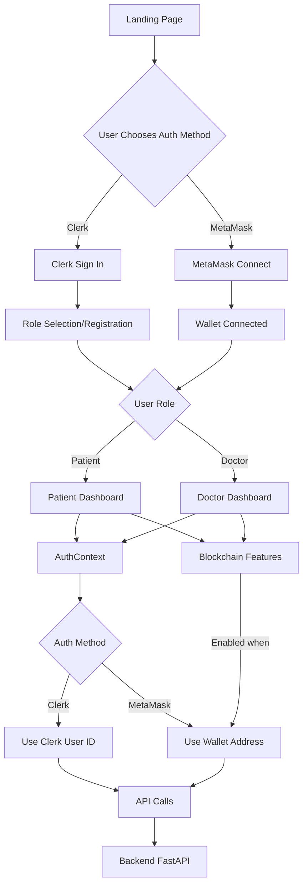
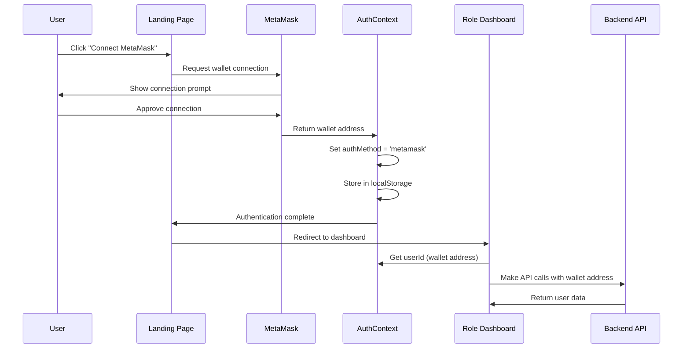
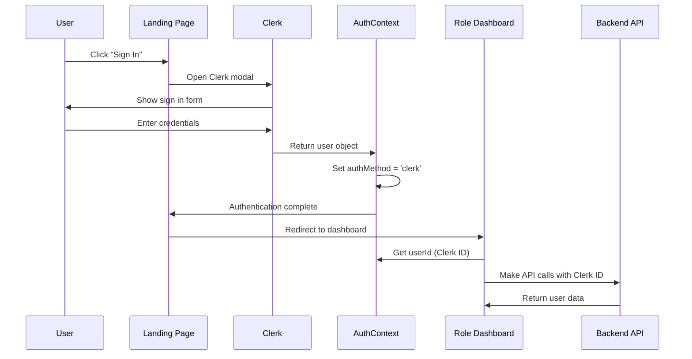
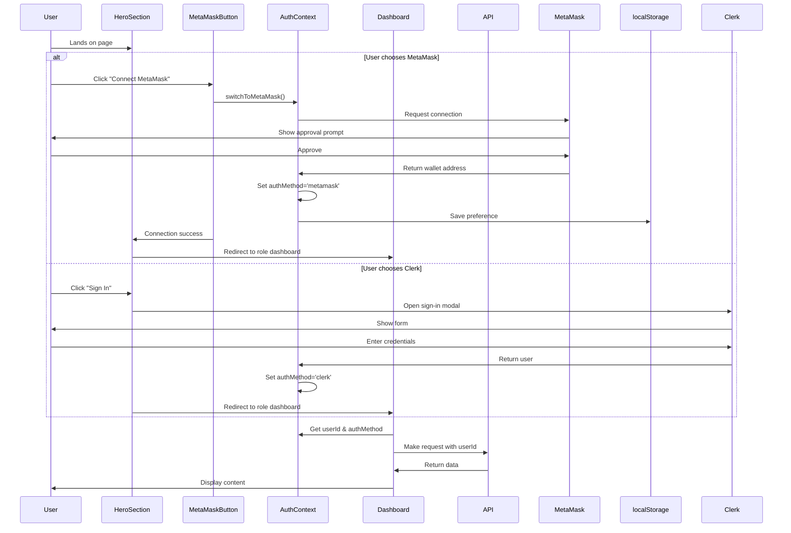

# Design Document: MetaMask Authentication Integration

## Overview

This design integrates MetaMask wallet authentication as an alternative to Clerk authentication in the MediChain AI application. Users can choose to authenticate using either their Web3 wallet (MetaMask) or traditional Clerk authentication (email/password). The system maintains a unified authentication context that seamlessly handles both methods, enabling blockchain features when wallet authentication is active and providing role-based access control for patient and doctor dashboards.

The existing infrastructure (AuthContext, MetaMaskButton, useWallet hook) is already in place. This design focuses on integrating MetaMask authentication into the user-facing flows, updating dashboard pages to use the unified auth context, and ensuring API calls properly handle wallet addresses as patient identifiers.

## Architecture



## Sequence Diagrams

### MetaMask Authentication Flow



### Clerk Authentication Flow (Existing)



## Components and Interfaces

### Component 1: Enhanced HeroSection

**Purpose**: Landing page hero section with dual authentication options (Clerk + MetaMask)

**Interface**:
```typescript
interface HeroSectionProps {
  // No props - uses hooks internally
}

interface AuthButtonState {
  isClerkSignedIn: boolean;
  walletAddress: string | null;
  isWalletConnected: boolean;
}
```

**Responsibilities**:
- Display MetaMask login button alongside Clerk sign-in buttons
- Handle MetaMask connection and redirect to role selection
- Show visual indicator of which auth method is active
- Maintain existing Clerk authentication flow

### Component 2: Updated Patient Dashboard

**Purpose**: Patient dashboard using unified auth context

**Interface**:
```typescript
interface PatientDashboardProps {
  // No props - uses hooks internally
}

interface PatientDashboardState {
  userId: string | null;
  authMethod: 'clerk' | 'metamask' | null;
  records: Analysis[];
  selectedRecord: Analysis | null;
  activeTab: TabType;
}
```

**Responsibilities**:
- Use `useAuth()` from AuthContext instead of Clerk's `useAuth()`
- Pass wallet address as `patient_wallet` in API calls when using MetaMask
- Enable blockchain features when wallet is connected
- Display auth method indicator in UI

### Component 3: Updated Doctor Dashboard

**Purpose**: Doctor dashboard using unified auth context

**Interface**:
```typescript
interface DoctorDashboardProps {
  // No props - uses hooks internally
}

interface DoctorDashboardState {
  userId: string | null;
  authMethod: 'clerk' | 'metamask' | null;
  grants: GrantedRecord[];
  appointments: Appointment[];
  profile: DoctorProfile | null;
}
```

**Responsibilities**:
- Use `useAuth()` from AuthContext instead of Clerk's `useAuth()`
- Pass wallet address as `doctor_wallet` in API calls when using MetaMask
- Enable blockchain features when wallet is connected
- Display auth method indicator in UI

### Component 4: AuthMethodIndicator (New)

**Purpose**: Visual indicator showing which authentication method is active

**Interface**:
```typescript
interface AuthMethodIndicatorProps {
  authMethod: 'clerk' | 'metamask' | null;
  userId: string | null;
  className?: string;
}
```

**Responsibilities**:
- Display badge showing "Clerk" or "MetaMask" authentication
- Show user identifier (Clerk ID or wallet address)
- Provide option to switch authentication methods
- Style appropriately for each auth method

## Data Models

### AuthContext State

```typescript
interface AuthContextType {
  userId: string | null;              // Clerk ID or wallet address
  authMethod: 'clerk' | 'metamask' | null;
  isAuthenticated: boolean;
  isLoading: boolean;
  walletAddress: string | null;       // Always available if wallet connected
  clerkUser: any;                     // Clerk user object if signed in
  switchToMetaMask: () => Promise<void>;
  switchToClerk: () => void;
}
```

**Validation Rules**:
- `userId` must be non-null when `isAuthenticated` is true
- `authMethod` must match the source of `userId`
- `walletAddress` must be valid Ethereum address format when using MetaMask
- `clerkUser` must be non-null when `authMethod` is 'clerk'

### API Request Payload (Updated)

```typescript
interface AnalyzeReportRequest {
  file: File;
  patient_wallet: string;  // Can be Clerk ID or wallet address
  authMethod: 'clerk' | 'metamask';
}

interface GetRecordsRequest {
  patient_wallet: string;  // Can be Clerk ID or wallet address
  authMethod: 'clerk' | 'metamask';
}
```

**Validation Rules**:
- `patient_wallet` must be non-empty string
- `authMethod` must match the authentication method used
- Backend should handle both Clerk IDs and wallet addresses

## Main Algorithm/Workflow



## Key Functions with Formal Specifications

### Function 1: switchToMetaMask()

```typescript
async function switchToMetaMask(): Promise<void>
```

**Preconditions:**
- MetaMask extension is installed in browser
- User has at least one Ethereum account in MetaMask
- Browser supports `window.ethereum` API

**Postconditions:**
- `authMethod` is set to 'metamask'
- `walletAddress` contains valid Ethereum address
- `userId` equals `walletAddress`
- `isAuthenticated` is true
- localStorage contains 'authMethod' = 'metamask'
- If connection fails, error is thrown and state remains unchanged

**Loop Invariants:** N/A (no loops)

### Function 2: handleMetaMaskLogin()

```typescript
async function handleMetaMaskLogin(onSuccess?: () => void): Promise<void>
```

**Preconditions:**
- Component is mounted
- MetaMask is available
- User is not already authenticated via MetaMask

**Postconditions:**
- If successful: wallet is connected, user is redirected to role dashboard
- If failed: error message is displayed, user remains on landing page
- `onSuccess` callback is invoked if provided and connection succeeds
- No side effects if user cancels MetaMask prompt

**Loop Invariants:** N/A (no loops)

### Function 3: getAuthenticatedUserId()

```typescript
function getAuthenticatedUserId(authContext: AuthContextType): string | null
```

**Preconditions:**
- `authContext` is defined and not null
- `authContext.authMethod` is one of: 'clerk', 'metamask', or null

**Postconditions:**
- Returns wallet address if `authMethod` is 'metamask' and wallet is connected
- Returns Clerk user ID if `authMethod` is 'clerk' and user is signed in
- Returns null if not authenticated
- Return value matches `authContext.userId`
- No mutations to input parameter

**Loop Invariants:** N/A (no loops)

### Function 4: updateDashboardWithAuth()

```typescript
async function updateDashboardWithAuth(
  userId: string,
  authMethod: 'clerk' | 'metamask'
): Promise<void>
```

**Preconditions:**
- `userId` is non-empty string
- `authMethod` is either 'clerk' or 'metamask'
- User has valid authentication session
- Dashboard component is mounted

**Postconditions:**
- API calls use `userId` as patient/doctor identifier
- Blockchain features are enabled if `authMethod` is 'metamask'
- Auth method indicator displays correct badge
- Records/appointments are fetched and displayed
- If API call fails, error is handled gracefully

**Loop Invariants:**
- For record fetching loops: All previously fetched records are valid
- For appointment loops: All processed appointments have valid timestamps

## Algorithmic Pseudocode

### Main Authentication Flow

```pascal
ALGORITHM handleUserAuthentication(userChoice)
INPUT: userChoice of type ('clerk' | 'metamask')
OUTPUT: authenticated user session

BEGIN
  ASSERT userChoice IN {'clerk', 'metamask'}
  
  IF userChoice = 'metamask' THEN
    // MetaMask authentication flow
    ASSERT window.ethereum IS NOT NULL
    
    TRY
      walletAddress ← connectWallet()
      ASSERT isValidEthereumAddress(walletAddress)
      
      setAuthMethod('metamask')
      setUserId(walletAddress)
      localStorage.setItem('authMethod', 'metamask')
      
      redirectToDashboard()
    CATCH error
      displayError("Failed to connect MetaMask")
      RETURN
    END TRY
    
  ELSE IF userChoice = 'clerk' THEN
    // Clerk authentication flow
    openClerkModal()
    
    AWAIT clerkUser ← clerkSignIn()
    ASSERT clerkUser IS NOT NULL
    
    setAuthMethod('clerk')
    setUserId(clerkUser.id)
    localStorage.setItem('authMethod', 'clerk')
    
    redirectToDashboard()
  END IF
  
  ASSERT isAuthenticated() = true
  ASSERT userId IS NOT NULL
END
```

**Preconditions:**
- userChoice is valid authentication method
- Browser environment supports chosen method
- User has necessary credentials/wallet

**Postconditions:**
- User is authenticated with chosen method
- userId is set correctly
- authMethod is persisted in localStorage
- User is redirected to appropriate dashboard

**Loop Invariants:** N/A (no loops in main flow)

### Dashboard Initialization with Unified Auth

```pascal
ALGORITHM initializeDashboard()
INPUT: none (uses AuthContext)
OUTPUT: initialized dashboard state

BEGIN
  // Get authentication state
  authState ← useAuth()
  ASSERT authState IS NOT NULL
  
  userId ← authState.userId
  authMethod ← authState.authMethod
  
  // Validate authentication
  IF userId = NULL OR authMethod = NULL THEN
    redirectToHome()
    RETURN
  END IF
  
  ASSERT userId IS NOT NULL
  ASSERT authMethod IN {'clerk', 'metamask'}
  
  // Initialize dashboard data
  TRY
    // Fetch user records
    records ← fetchRecords(userId, authMethod)
    ASSERT ALL record IN records: record.isValid()
    
    // Fetch appointments
    appointments ← fetchAppointments(userId, authMethod)
    ASSERT ALL apt IN appointments: apt.hasValidTimestamp()
    
    // Enable blockchain features if using MetaMask
    IF authMethod = 'metamask' THEN
      enableBlockchainFeatures()
      ASSERT blockchainFeaturesEnabled = true
    END IF
    
    // Update UI state
    setRecords(records)
    setAppointments(appointments)
    setIsLoading(false)
    
  CATCH error
    displayError("Failed to load dashboard data")
    setIsLoading(false)
  END TRY
  
  ASSERT isLoading = false
END
```

**Preconditions:**
- User is authenticated (userId and authMethod are set)
- Dashboard component is mounted
- API endpoints are available

**Postconditions:**
- Dashboard data is loaded and displayed
- Blockchain features are enabled if using MetaMask
- Loading state is set to false
- Errors are handled gracefully

**Loop Invariants:**
- For records loop: All processed records are valid
- For appointments loop: All processed appointments have valid data

### API Request with Auth Method

```pascal
ALGORITHM makeAuthenticatedAPIRequest(endpoint, userId, authMethod)
INPUT: endpoint (string), userId (string), authMethod ('clerk' | 'metamask')
OUTPUT: API response data

BEGIN
  ASSERT endpoint IS NOT EMPTY
  ASSERT userId IS NOT EMPTY
  ASSERT authMethod IN {'clerk', 'metamask'}
  
  // Prepare request payload
  payload ← {
    patient_wallet: userId,
    authMethod: authMethod
  }
  
  // Add authentication headers
  IF authMethod = 'clerk' THEN
    headers ← getClerkAuthHeaders()
  ELSE IF authMethod = 'metamask' THEN
    headers ← getWalletAuthHeaders(userId)
  END IF
  
  ASSERT headers IS NOT NULL
  
  // Make API request
  TRY
    response ← fetch(endpoint, {
      method: 'POST',
      headers: headers,
      body: JSON.stringify(payload)
    })
    
    ASSERT response.status IN {200, 201}
    
    data ← response.json()
    ASSERT data IS NOT NULL
    
    RETURN data
    
  CATCH error
    logError(error)
    THROW APIError("Request failed")
  END TRY
END
```

**Preconditions:**
- endpoint is valid API URL
- userId is authenticated user identifier
- authMethod matches current authentication state
- Network connection is available

**Postconditions:**
- API request is made with correct authentication
- Response data is returned if successful
- Error is thrown if request fails
- No side effects on input parameters

**Loop Invariants:** N/A (no loops)

## Example Usage

### Example 1: MetaMask Login from Landing Page

```typescript
// In HeroSection component
import { useAuth } from '@/contexts/AuthContext';
import MetaMaskButton from '@/components/MetaMaskButton';
import { useRouter } from 'next/navigation';

export default function HeroSection() {
  const { switchToMetaMask } = useAuth();
  const router = useRouter();

  const handleMetaMaskSuccess = () => {
    // Redirect to role selection or dashboard
    router.push('/register?role=patient');
  };

  return (
    <div>
      {/* Existing Clerk buttons */}
      <SignInButton mode="modal">
        <button>Sign In with Email</button>
      </SignInButton>

      {/* New MetaMask button */}
      <MetaMaskButton 
        onSuccess={handleMetaMaskSuccess}
        variant="primary"
      />
    </div>
  );
}
```

### Example 2: Using Unified Auth in Patient Dashboard

```typescript
// In patient/page.tsx
import { useAuth } from '@/contexts/AuthContext';
import { getPatientRecords } from '@/lib/api';

export default function PatientDashboard() {
  const { userId, authMethod, isAuthenticated } = useAuth();
  const [records, setRecords] = useState([]);

  useEffect(() => {
    if (!isAuthenticated || !userId) {
      router.push('/');
      return;
    }

    // Fetch records using unified auth
    const loadRecords = async () => {
      const data = await getPatientRecords(userId, authMethod);
      setRecords(data);
    };

    loadRecords();
  }, [userId, authMethod, isAuthenticated]);

  return (
    <div>
      <AuthMethodIndicator 
        authMethod={authMethod} 
        userId={userId} 
      />
      {/* Rest of dashboard */}
    </div>
  );
}
```

### Example 3: Switching Between Auth Methods

```typescript
// In user settings or profile
import { useAuth } from '@/contexts/AuthContext';

export default function AuthSettings() {
  const { authMethod, switchToMetaMask, switchToClerk } = useAuth();

  const handleSwitchToMetaMask = async () => {
    try {
      await switchToMetaMask();
      alert('Switched to MetaMask authentication');
    } catch (error) {
      alert('Failed to switch: ' + error.message);
    }
  };

  return (
    <div>
      <p>Current method: {authMethod}</p>
      
      {authMethod === 'clerk' && (
        <button onClick={handleSwitchToMetaMask}>
          Switch to MetaMask
        </button>
      )}
      
      {authMethod === 'metamask' && (
        <button onClick={switchToClerk}>
          Switch to Clerk
        </button>
      )}
    </div>
  );
}
```

## Correctness Properties

### Property 1: Authentication Consistency
```typescript
// For all authenticated users:
∀ user: isAuthenticated(user) ⟹ 
  (userId(user) ≠ null ∧ authMethod(user) ∈ {'clerk', 'metamask'})
```

### Property 2: Auth Method Matches User ID Source
```typescript
// User ID source must match authentication method:
∀ user: authMethod(user) = 'metamask' ⟹ userId(user) = walletAddress(user)
∀ user: authMethod(user) = 'clerk' ⟹ userId(user) = clerkUserId(user)
```

### Property 3: Blockchain Features Enabled Only with MetaMask
```typescript
// Blockchain features require MetaMask authentication:
∀ user: blockchainFeaturesEnabled(user) ⟹ authMethod(user) = 'metamask'
```

### Property 4: API Requests Include Auth Method
```typescript
// All API requests must include authentication method:
∀ request: isAPIRequest(request) ⟹ 
  (request.authMethod ∈ {'clerk', 'metamask'} ∧ request.userId ≠ null)
```

### Property 5: Wallet Address Format Validation
```typescript
// MetaMask addresses must be valid Ethereum addresses:
∀ user: authMethod(user) = 'metamask' ⟹ 
  isValidEthereumAddress(userId(user))
```

## Error Handling

### Error Scenario 1: MetaMask Not Installed

**Condition**: User clicks "Connect MetaMask" but extension is not installed
**Response**: Display error message with link to MetaMask download page
**Recovery**: User installs MetaMask and retries connection

### Error Scenario 2: User Rejects MetaMask Connection

**Condition**: User cancels MetaMask connection prompt
**Response**: Display message explaining connection is required
**Recovery**: User can retry connection or use Clerk authentication

### Error Scenario 3: Network Mismatch

**Condition**: User's MetaMask is on wrong network (not Sepolia/Hardhat)
**Response**: Display message asking user to switch networks
**Recovery**: User switches network in MetaMask, connection retries

### Error Scenario 4: API Call with Wrong Auth Method

**Condition**: API receives request with mismatched userId and authMethod
**Response**: Backend returns 401 Unauthorized error
**Recovery**: Frontend refreshes authentication state and retries

### Error Scenario 5: Wallet Disconnected During Session

**Condition**: User disconnects wallet while using dashboard
**Response**: AuthContext detects disconnection, clears auth state
**Recovery**: User is redirected to landing page to re-authenticate

## Testing Strategy

### Unit Testing Approach

Test individual components and functions in isolation:

- **AuthContext**: Test state management, auth method switching, localStorage persistence
- **MetaMaskButton**: Test connection flow, error handling, UI states
- **Dashboard components**: Test auth state consumption, API call formatting
- **Auth utility functions**: Test userId extraction, validation, format checking

**Key Test Cases**:
- AuthContext correctly identifies auth method from localStorage
- switchToMetaMask() updates state and persists preference
- Dashboard redirects unauthenticated users
- API requests include correct authMethod parameter

### Property-Based Testing Approach

**Property Test Library**: fast-check (for TypeScript/JavaScript)

**Property 1: Authentication State Consistency**
```typescript
// Generate random auth states and verify consistency
fc.assert(
  fc.property(
    fc.record({
      authMethod: fc.constantFrom('clerk', 'metamask', null),
      userId: fc.option(fc.string()),
      walletAddress: fc.option(fc.hexaString()),
      clerkUser: fc.option(fc.object())
    }),
    (authState) => {
      // If authenticated, userId must be non-null
      if (authState.authMethod !== null) {
        expect(authState.userId).not.toBeNull();
      }
      
      // Auth method must match userId source
      if (authState.authMethod === 'metamask') {
        expect(authState.userId).toBe(authState.walletAddress);
      }
      if (authState.authMethod === 'clerk') {
        expect(authState.clerkUser).not.toBeNull();
      }
    }
  )
);
```

**Property 2: Wallet Address Format**
```typescript
// All MetaMask userIds must be valid Ethereum addresses
fc.assert(
  fc.property(
    fc.hexaString({ minLength: 40, maxLength: 40 }),
    (address) => {
      const fullAddress = '0x' + address;
      const isValid = /^0x[a-fA-F0-9]{40}$/.test(fullAddress);
      expect(isValid).toBe(true);
    }
  )
);
```

### Integration Testing Approach

Test complete authentication flows end-to-end:

- **MetaMask Login Flow**: User connects wallet → redirected to dashboard → data loads
- **Clerk Login Flow**: User signs in → redirected to dashboard → data loads
- **Auth Method Switching**: User switches from Clerk to MetaMask → state updates correctly
- **API Integration**: Dashboard makes API calls with correct auth parameters

**Test Environment**:
- Use Hardhat local blockchain for MetaMask testing
- Mock Clerk authentication in test environment
- Use MSW (Mock Service Worker) for API mocking

## Performance Considerations

- **Lazy Loading**: MetaMask connection only initiated when user clicks button
- **State Persistence**: Auth method stored in localStorage to avoid re-authentication
- **Optimistic UI**: Show loading states during wallet connection
- **Memoization**: Use React.memo for AuthMethodIndicator to prevent unnecessary re-renders
- **Debouncing**: Debounce wallet connection attempts to prevent rapid retries

## Security Considerations

- **Wallet Address Validation**: Always validate Ethereum address format before using as userId
- **HTTPS Required**: MetaMask requires secure context (HTTPS) in production
- **No Private Key Storage**: Never store or request private keys
- **Session Management**: Clear auth state on logout/disconnect
- **CSRF Protection**: Backend should validate auth method matches request source
- **Rate Limiting**: Implement rate limiting on authentication endpoints

## Dependencies

### Frontend Dependencies
- `@clerk/nextjs`: ^4.x (existing Clerk authentication)
- `ethers`: ^6.x (existing Web3 library)
- `next`: ^14.x (Next.js framework)
- `react`: ^18.x (React library)
- `typescript`: ^5.x (TypeScript)

### Browser Requirements
- MetaMask extension installed (for MetaMask auth)
- Modern browser with Web3 support
- LocalStorage enabled

### Backend Dependencies
- FastAPI (existing Python backend)
- Endpoint updates to handle both Clerk IDs and wallet addresses
- Database schema supports both identifier types

### External Services
- Clerk authentication service
- Ethereum network (Sepolia testnet or Hardhat local)
- IPFS (for blockchain features)
