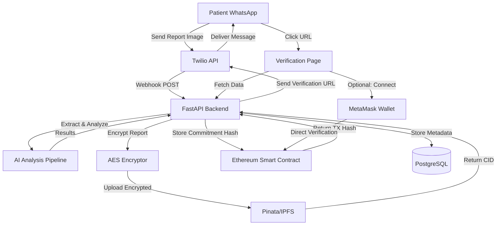
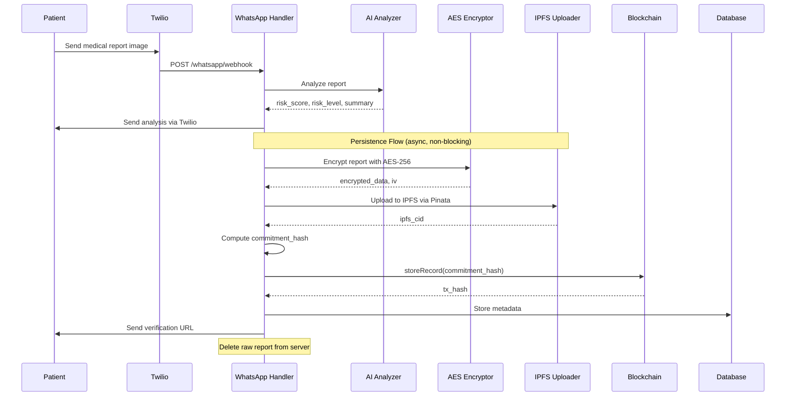
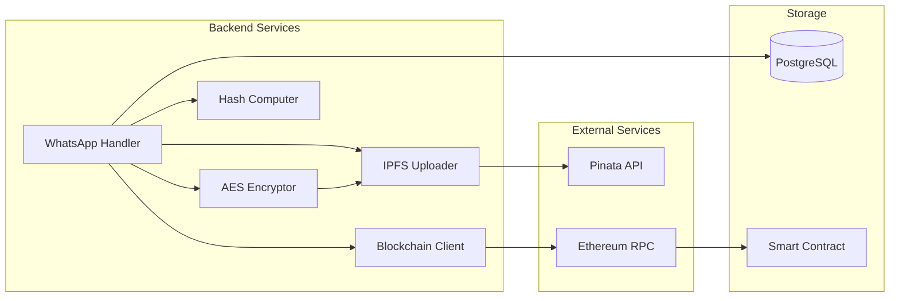

# Design Document: WhatsApp Blockchain Persistence + Insurance Verification

## Overview

This design specifies the architecture for adding blockchain persistence to MediChain AI's WhatsApp medical report analysis feature. The system transforms the current ephemeral analysis flow into a verifiable, privacy-preserving medical record system suitable for insurance verification.

### Current State

The existing WhatsApp integration (`backend/routes/whatsapp.py`) provides:
- Twilio webhook receiving medical report images
- 3-layer AI analysis pipeline (ClinicalBERT → BioGPT/NVIDIA → Random Forest)
- Immediate WhatsApp response with analysis results
- Ephemeral processing (no persistence)

### Target State

The enhanced system will add:
- AES-256 encryption of medical reports
- IPFS storage via Pinata for decentralized persistence
- Ethereum blockchain commitment hash storage
- Public verification page accessible via WhatsApp link
- Optional MetaMask integration for advanced verification
- Privacy-preserving architecture (no PII on blockchain)

### Key Design Principles

1. **Privacy First**: No personal identifiable information (PII) on blockchain or IPFS
2. **Graceful Degradation**: Analysis always succeeds even if blockchain fails
3. **Zero-Knowledge**: Backend never stores raw phone numbers
4. **Verifiable**: Insurance providers can verify authenticity without accessing medical data
5. **Mobile-First**: Verification page optimized for WhatsApp in-app browser

## Architecture

### System Context Diagram



### Data Flow Diagram



### Component Architecture



## Components and Interfaces

### 1. AES Encryptor Service

**Location**: `backend/services/aes_encryptor.py`

**Purpose**: Encrypt medical reports using AES-256 with phone-derived keys

**Interface**:
```python
class AESEncryptor:
    def __init__(self, server_secret: str):
        """Initialize with server secret from environment"""
        
    def derive_key(self, phone_hash: str) -> bytes:
        """Derive encryption key from phone hash + server secret"""
        
    def encrypt(self, plaintext: bytes, phone_hash: str) -> tuple[bytes, bytes]:
        """
        Encrypt data with AES-256-CBC
        Returns: (encrypted_data, iv)
        """
        
    def decrypt(self, encrypted_data: bytes, iv: bytes, phone_hash: str) -> bytes:
        """Decrypt data with AES-256-CBC"""
```

**Implementation Details**:
- Algorithm: AES-256-CBC
- Key Derivation: PBKDF2-HMAC-SHA256 with 100,000 iterations
- Key Material: SHA-256(phone_number) + SERVER_ENCRYPTION_SECRET
- IV: 16 bytes of cryptographically random data per encryption
- IV Storage: Prepended to ciphertext for transmission

**Security Considerations**:
- Server secret must be 32+ bytes of cryptographic randomness
- Phone hash provides user-specific key derivation
- Unique IV per encryption prevents pattern analysis
- PBKDF2 iterations protect against brute force

### 2. IPFS Uploader Service

**Location**: `backend/services/ipfs_uploader.py`

**Purpose**: Upload encrypted reports to IPFS via Pinata API

**Interface**:
```python
class IPFSUploader:
    def __init__(self, api_key: str, secret_key: str):
        """Initialize with Pinata credentials"""
        
    async def upload(self, data: bytes, filename: str) -> str:
        """
        Upload data to IPFS via Pinata
        Returns: ipfs_cid (e.g., "QmXxx..." or "bafyxxx...")
        """
        
    async def pin(self, cid: str) -> bool:
        """Ensure CID is pinned for persistence"""
```

**Implementation Details**:
- API Endpoint: `https://api.pinata.cloud/pinning/pinFileToIPFS`
- Authentication: JWT token from API key + secret
- Timeout: 30 seconds
- Retry Logic: 3 attempts with exponential backoff
- Pinning: Automatic via Pinata's pinning service

**Error Handling**:
- Network timeout → raise `IPFSTimeoutError`
- Authentication failure → raise `IPFSAuthError`
- Upload failure → raise `IPFSUploadError`
- All errors logged with context for debugging

### 3. Blockchain Client Service

**Location**: `backend/services/blockchain_client.py`

**Purpose**: Interact with Ethereum smart contract for commitment storage

**Interface**:
```python
class BlockchainClient:
    def __init__(self, rpc_url: str, contract_address: str, private_key: str):
        """Initialize with Ethereum connection details"""
        
    async def store_record(self, commitment_hash: str) -> str:
        """
        Store commitment hash on blockchain
        Returns: transaction_hash
        """
        
    async def verify_record(self, tx_hash: str) -> dict:
        """
        Verify record exists on blockchain
        Returns: {exists: bool, timestamp: int, commitment_hash: str}
        """
        
    def compute_commitment_hash(
        self, 
        ipfs_cid: str, 
        risk_score: int, 
        timestamp: int, 
        phone_hash: str
    ) -> str:
        """Compute keccak256 commitment hash"""
```

**Implementation Details**:
- Library: web3.py
- Network: Ethereum Sepolia testnet (production: Mainnet or L2)
- Gas Strategy: Medium priority (adjustable)
- Transaction Confirmation: Wait for 1 block confirmation
- Commitment Hash: `keccak256(ipfs_cid + risk_score + timestamp + phone_hash)`

**Error Handling**:
- Insufficient gas → raise `BlockchainGasError`
- Network failure → raise `BlockchainNetworkError`
- Transaction revert → raise `BlockchainTransactionError`
- All errors logged with transaction details

### 4. Hash Computer Utility

**Location**: `backend/services/hash_computer.py`

**Purpose**: Compute cryptographic hashes for privacy preservation

**Interface**:
```python
class HashComputer:
    @staticmethod
    def sha256(data: str) -> str:
        """Compute SHA-256 hash (for phone numbers)"""
        
    @staticmethod
    def keccak256(data: str) -> str:
        """Compute Keccak-256 hash (for commitment)"""
```

**Implementation Details**:
- SHA-256: Standard library `hashlib`
- Keccak-256: `eth_utils.keccak` (Ethereum-compatible)
- Output Format: Hexadecimal string with "0x" prefix

### 5. Enhanced WhatsApp Handler

**Location**: `backend/routes/whatsapp.py` (modified)

**Purpose**: Orchestrate the complete flow from analysis to blockchain persistence

**New Functions**:
```python
async def persist_to_blockchain(
    phone_number: str,
    report_text: str,
    risk_score: int,
    risk_level: str,
    timestamp: int
) -> dict:
    """
    Persist analysis to blockchain
    Returns: {
        success: bool,
        tx_hash: str | None,
        ipfs_cid: str | None,
        verification_url: str | None,
        error: str | None
    }
    """
```

**Modified Webhook Flow**:
1. Receive image → Extract text (existing)
2. AI analysis → Get results (existing)
3. Send immediate WhatsApp response (existing)
4. **NEW**: Encrypt report
5. **NEW**: Upload to IPFS
6. **NEW**: Store commitment on blockchain
7. **NEW**: Save metadata to database
8. **NEW**: Send verification URL
9. **NEW**: Delete raw report from server

**Error Handling Strategy**:
- Wrap blockchain persistence in try-except
- Log all errors with context
- Never block patient analysis
- Send verification URL only on success

### 6. Verification API Endpoint

**Location**: `backend/routes/verify.py` (new)

**Purpose**: Provide verification data for frontend

**Interface**:
```python
@router.get("/verify/{tx_hash}")
async def get_verification(tx_hash: str) -> dict:
    """
    Get verification data for transaction hash
    Returns: {
        status: "verified" | "not_found" | "pending",
        risk_level: str,
        timestamp: int,
        ipfs_cid: str,
        commitment_hash: str,
        blockchain_verified: bool
    }
    """
```

**Implementation**:
1. Query database for record with `tx_hash`
2. If not found → return 404
3. Query blockchain for verification
4. Return combined data (no PII)

### 7. Verification Page Component

**Location**: `frontend/src/app/verify/[hash]/page.tsx` (new)

**Purpose**: Display blockchain proof and verification instructions

**Component Structure**:
```typescript
export default function VerifyPage({ params }: { params: { hash: string } }) {
  // Fetch verification data
  // Display verification status
  // Show blockchain proof
  // Provide insurance instructions
  // Optional: MetaMask integration
}
```

**UI Sections**:
1. **Verification Status Banner**: Green (verified) / Red (not found)
2. **Record Details Card**: Risk level, timestamp
3. **Blockchain Proof Card**: TX hash, commitment hash, Etherscan link
4. **Insurance Verification Instructions**: Step-by-step guide
5. **Optional MetaMask Section**: Connect wallet for direct verification

**MetaMask Integration** (Optional):
```typescript
const connectWallet = async () => {
  if (typeof window.ethereum !== 'undefined') {
    const accounts = await window.ethereum.request({ 
      method: 'eth_requestAccounts' 
    });
    setWalletConnected(true);
  }
};

const verifyOnChain = async () => {
  const contract = new ethers.Contract(
    CONTRACT_ADDRESS,
    CONTRACT_ABI,
    provider
  );
  const record = await contract.getRecord(txHash);
  // Display on-chain data
};
```

**Responsive Design**:
- Mobile-first (WhatsApp in-app browser)
- Tailwind CSS utility classes
- Dark mode support
- Copy-to-clipboard for hashes

## Data Models

### Database Schema

**Table**: `whatsapp_records`

```sql
CREATE TABLE whatsapp_records (
    id UUID PRIMARY KEY DEFAULT gen_random_uuid(),
    phone_hash VARCHAR(64) NOT NULL,
    ipfs_cid VARCHAR(100) NOT NULL,
    commitment_hash VARCHAR(66) NOT NULL,
    tx_hash VARCHAR(66) NOT NULL UNIQUE,
    risk_level VARCHAR(20) NOT NULL,
    risk_score INTEGER,
    created_at TIMESTAMP WITH TIME ZONE DEFAULT NOW(),
    deleted_at TIMESTAMP WITH TIME ZONE,
    
    -- Indexes for fast lookups
    INDEX idx_tx_hash (tx_hash),
    INDEX idx_phone_hash (phone_hash),
    INDEX idx_created_at (created_at DESC)
);
```

**Field Descriptions**:
- `phone_hash`: SHA-256 of phone number (privacy-preserving identifier)
- `ipfs_cid`: IPFS content identifier for encrypted report
- `commitment_hash`: Keccak-256 commitment stored on blockchain
- `tx_hash`: Ethereum transaction hash (used in verification URL)
- `risk_level`: "low", "medium", or "high"
- `risk_score`: Numeric risk score (0-100)
- `deleted_at`: Soft deletion timestamp (GDPR compliance)

**Migration File**: `backend/migrations/003_create_whatsapp_records.sql`

### Smart Contract Data Model

**Contract**: `MediChainRecords.sol` (modified)

**New Struct**:
```solidity
struct WhatsAppRecord {
    bytes32 commitmentHash;
    uint256 timestamp;
    bool exists;
}
```

**New Mapping**:
```solidity
mapping(bytes32 => WhatsAppRecord) public whatsappRecords;
```

**New Functions**:
```solidity
function storeWhatsAppRecord(bytes32 _commitmentHash) 
    external 
    returns (bytes32 recordId);

function verifyWhatsAppRecord(bytes32 _recordId) 
    external 
    view 
    returns (bool exists, uint256 timestamp, bytes32 commitmentHash);
```

**Events**:
```solidity
event WhatsAppRecordStored(
    bytes32 indexed recordId,
    bytes32 commitmentHash,
    uint256 timestamp
);
```

### API Response Models

**Verification Response**:
```typescript
interface VerificationResponse {
  status: "verified" | "not_found" | "pending";
  risk_level?: string;
  timestamp?: number;
  ipfs_cid?: string;
  commitment_hash?: string;
  blockchain_verified?: boolean;
  etherscan_url?: string;
}
```

**Persistence Result**:
```python
class PersistenceResult(BaseModel):
    success: bool
    tx_hash: Optional[str] = None
    ipfs_cid: Optional[str] = None
    verification_url: Optional[str] = None
    error: Optional[str] = None
```


## Correctness Properties

*A property is a characteristic or behavior that should hold true across all valid executions of a system—essentially, a formal statement about what the system should do. Properties serve as the bridge between human-readable specifications and machine-verifiable correctness guarantees.*


### Property Reflection

After analyzing all acceptance criteria, I identified several areas of redundancy:

1. **Privacy Properties**: Multiple criteria (2.1, 2.2, 2.3, 2.4, 2.7, 2.8, 5.7) all relate to ensuring no PII is stored or displayed. These can be consolidated into comprehensive privacy properties.

2. **Cleanup Properties**: Criteria 1.9 and 2.6 are identical - both require deleting raw reports after IPFS upload.

3. **Error Handling Properties**: Criteria 3.1-3.8 describe graceful degradation for IPFS and blockchain failures. These can be consolidated into properties about non-blocking behavior and error handling.

4. **Smart Contract Properties**: Criteria 4.3-4.6 all relate to what happens when storeRecord is called. These can be combined into a single comprehensive property about record creation.

5. **Verification Flow Properties**: Criteria 5.2-5.6 describe the verification endpoint behavior. These can be consolidated into properties about the verification flow.

6. **Round-Trip Property**: Criterion 12.1 is the fundamental encryption property that subsumes 12.2.

7. **Configuration Properties**: Many criteria (8.7, 9.2, 9.3, etc.) are configuration requirements that should be validated once, not tested as properties.

After reflection, I've consolidated 60+ criteria into 18 unique, non-redundant properties that provide comprehensive coverage.

### Property 1: Encryption Round-Trip Preservation

*For any* valid medical report and phone hash, encrypting the report and then decrypting it with the same phone hash should return the original report content.

**Validates: Requirements 12.1**

### Property 2: Encryption IV Uniqueness

*For any* medical report encrypted multiple times with the same key, each encryption should produce different ciphertext due to unique initialization vectors.

**Validates: Requirements 8.3, 12.3**

### Property 3: Encryption Key Derivation Consistency

*For any* phone hash, deriving the encryption key multiple times with the same server secret should produce identical keys.

**Validates: Requirements 2.5, 8.2**

### Property 4: IPFS Upload Returns Valid CID

*For any* successful IPFS upload, the returned CID should match the format "Qm..." (CIDv0) or "bafy..." (CIDv1).

**Validates: Requirements 1.3, 9.4**

### Property 5: Commitment Hash Determinism

*For any* set of inputs (ipfs_cid, risk_score, timestamp, phone_hash), computing the commitment hash multiple times should produce identical results.

**Validates: Requirements 1.4**

### Property 6: Phone Hash Privacy Preservation

*For any* phone number, the system should store only its SHA-256 hash and never store the raw phone number in the database.

**Validates: Requirements 2.1, 2.2**

### Property 7: Blockchain Privacy Preservation

*For any* record stored on the blockchain, the smart contract should contain only the commitment hash and never contain patient names, phone numbers, or raw medical data.

**Validates: Requirements 2.3, 2.4**

### Property 8: Verification Page Privacy Preservation

*For any* verification page render, the page should display only risk_level, timestamp, and blockchain proof, and never display patient name, phone number, raw lab values, or phone hash.

**Validates: Requirements 2.7, 2.8, 5.7**

### Property 9: Raw Report Cleanup After Upload

*For any* medical report that is successfully uploaded to IPFS, the raw report file should be deleted from server storage immediately after upload completion.

**Validates: Requirements 1.9, 2.6**

### Property 10: Non-Blocking Analysis on IPFS Failure

*For any* IPFS upload failure, the patient should still receive their medical analysis via WhatsApp without delay.

**Validates: Requirements 3.1, 3.3, 3.7**

### Property 11: Non-Blocking Analysis on Blockchain Failure

*For any* blockchain write failure, the patient should still receive their medical analysis via WhatsApp without delay.

**Validates: Requirements 3.4, 3.6, 3.8**

### Property 12: Error Logging on Persistence Failure

*For any* IPFS or blockchain failure, the system should log the error with sufficient context for debugging.

**Validates: Requirements 3.2, 3.5**

### Property 13: Smart Contract Record Creation Completeness

*For any* call to storeRecord with a valid commitment hash, the smart contract should create a record with the commitment hash, set timestamp to block.timestamp, set exists to true, and emit a RecordStored event.

**Validates: Requirements 4.3, 4.4, 4.5, 4.6**

### Property 14: Smart Contract Verification Correctness

*For any* transaction hash, calling verifyRecord should return true if and only if a record with that hash was previously stored.

**Validates: Requirements 4.8, 4.9**

### Property 15: Verification Endpoint Database Lookup

*For any* transaction hash provided to /api/verify/{tx_hash}, the endpoint should query the database for a matching record and return 404 if not found.

**Validates: Requirements 5.2, 5.8**

### Property 16: Verification Endpoint Blockchain Cross-Check

*For any* record found in the database, the verification endpoint should query the smart contract to verify the record exists on-chain before returning verification status.

**Validates: Requirements 5.3, 5.4, 5.5**

### Property 17: Verification Endpoint Response Completeness

*For any* verified record, the API response should include risk_level, timestamp, ipfs_cid, and commitment_hash, but never include phone_hash or patient identifiers.

**Validates: Requirements 5.6, 5.7**

### Property 18: Verification Page Wallet-Independent Access

*For any* valid transaction hash, the verification page should load and display verification data without requiring MetaMask wallet connection.

**Validates: Requirements 6.2**

### Property 19: Verification Page Data Fetching

*For any* verification page load with a transaction hash, the page should fetch data from /api/verify/{tx_hash} endpoint.

**Validates: Requirements 6.8**

### Property 20: Verification Page Status Banner Correctness

*For any* verification status ("verified" or "not_found"), the page should display the appropriate colored banner (green for verified, red for not found).

**Validates: Requirements 6.3**

### Property 21: Verification Page Content Completeness

*For any* verified record, the page should display a record details card with risk_level and timestamp, and a blockchain proof card with transaction hash and commitment hash.

**Validates: Requirements 6.4, 6.5**

### Property 22: IPFS Upload Timeout Handling

*For any* IPFS upload that exceeds 30 seconds, the uploader should raise a timeout exception.

**Validates: Requirements 9.6**

### Property 23: IPFS Upload Pinning

*For any* successful IPFS upload, the file should be pinned to ensure persistence.

**Validates: Requirements 9.7**

### Property 24: Decryption Failure with Incorrect Key

*For any* encrypted data, attempting to decrypt with an incorrect key should fail and not return the original plaintext.

**Validates: Requirements 12.4**

### Property 25: Decryption Failure with Corrupted Data

*For any* corrupted ciphertext, attempting to decrypt should fail gracefully without returning invalid plaintext.

**Validates: Requirements 12.5**

### Property 26: Database Record Persistence Completeness

*For any* successful blockchain persistence flow, the database should contain a record with phone_hash, ipfs_cid, commitment_hash, tx_hash, and risk_level.

**Validates: Requirements 1.10**

### Property 27: Verification URL Construction

*For any* transaction hash received from the blockchain, the system should construct a verification URL in the format "https://medichain.app/verify/{tx_hash}".

**Validates: Requirements 1.7**

### Property 28: Verification URL Delivery

*For any* successfully constructed verification URL, the system should send it to the patient via WhatsApp.

**Validates: Requirements 1.8**

## Error Handling

### Error Categories

1. **Network Errors**
   - IPFS upload timeout (30s)
   - Blockchain RPC connection failure
   - Pinata API rate limiting

2. **Cryptographic Errors**
   - Invalid encryption key derivation
   - Corrupted ciphertext
   - Hash computation failure

3. **Smart Contract Errors**
   - Insufficient gas
   - Transaction revert
   - Network congestion

4. **Database Errors**
   - Connection failure
   - Constraint violation
   - Query timeout

### Error Handling Strategy

**Principle**: Patient analysis must never be blocked by persistence failures.

**Implementation**:

```python
async def persist_to_blockchain(
    phone_number: str,
    report_text: str,
    risk_score: int,
    risk_level: str,
    timestamp: int
) -> PersistenceResult:
    try:
        # Step 1: Encrypt
        phone_hash = hash_computer.sha256(phone_number)
        encrypted_data, iv = aes_encryptor.encrypt(report_text, phone_hash)
        
        # Step 2: Upload to IPFS
        try:
            ipfs_cid = await ipfs_uploader.upload(encrypted_data, f"report_{timestamp}.enc")
        except IPFSTimeoutError as e:
            logger.error(f"IPFS timeout: {e}")
            return PersistenceResult(success=False, error="IPFS timeout")
        except IPFSUploadError as e:
            logger.error(f"IPFS upload failed: {e}")
            return PersistenceResult(success=False, error="IPFS upload failed")
        
        # Step 3: Compute commitment hash
        commitment_hash = blockchain_client.compute_commitment_hash(
            ipfs_cid, risk_score, timestamp, phone_hash
        )
        
        # Step 4: Store on blockchain
        try:
            tx_hash = await blockchain_client.store_record(commitment_hash)
        except BlockchainGasError as e:
            logger.error(f"Insufficient gas: {e}")
            return PersistenceResult(success=False, error="Insufficient gas")
        except BlockchainNetworkError as e:
            logger.error(f"Blockchain network error: {e}")
            return PersistenceResult(success=False, error="Blockchain network error")
        
        # Step 5: Store in database
        await db_insert("whatsapp_records", {
            "phone_hash": phone_hash,
            "ipfs_cid": ipfs_cid,
            "commitment_hash": commitment_hash,
            "tx_hash": tx_hash,
            "risk_level": risk_level,
            "risk_score": risk_score
        })
        
        # Step 6: Delete raw report
        os.remove(f"/tmp/report_{timestamp}.txt")
        
        # Step 7: Construct verification URL
        verification_url = f"https://medichain.app/verify/{tx_hash}"
        
        return PersistenceResult(
            success=True,
            tx_hash=tx_hash,
            ipfs_cid=ipfs_cid,
            verification_url=verification_url
        )
        
    except Exception as e:
        logger.error(f"Unexpected persistence error: {e}", exc_info=True)
        return PersistenceResult(success=False, error=str(e))
```

### Error Recovery

1. **IPFS Failures**: Retry with exponential backoff (3 attempts)
2. **Blockchain Failures**: Increase gas price and retry (2 attempts)
3. **Database Failures**: Use connection pooling and retry logic
4. **Catastrophic Failures**: Log error, alert monitoring, continue with analysis

### Monitoring and Alerting

- **Metrics**: Track success rate, latency, error types
- **Alerts**: Trigger on >10% failure rate or >5s latency
- **Logging**: Structured logs with correlation IDs

## Testing Strategy

### Dual Testing Approach

This feature requires both unit tests and property-based tests for comprehensive coverage:

**Unit Tests** focus on:
- Specific examples (e.g., encrypting a known report)
- Edge cases (e.g., empty reports, malformed CIDs)
- Error conditions (e.g., network timeouts, invalid keys)
- Integration points (e.g., Pinata API, smart contract calls)

**Property-Based Tests** focus on:
- Universal properties across all inputs (e.g., encryption round-trip)
- Randomized input generation (e.g., random reports, phone numbers)
- Invariant verification (e.g., no PII in database)
- Comprehensive coverage (100+ iterations per property)

### Property-Based Testing Configuration

**Library**: Hypothesis (Python) for backend, fast-check (TypeScript) for frontend

**Configuration**:
```python
from hypothesis import given, settings
import hypothesis.strategies as st

@settings(max_examples=100)
@given(
    report=st.text(min_size=100, max_size=10000),
    phone_number=st.text(min_size=10, max_size=15, alphabet=st.characters(whitelist_categories=('Nd',)))
)
def test_encryption_round_trip(report, phone_number):
    """
    Feature: whatsapp-blockchain-persistence
    Property 1: For any valid medical report and phone hash, 
    encrypting then decrypting should return the original report.
    """
    phone_hash = hash_computer.sha256(phone_number)
    encrypted_data, iv = aes_encryptor.encrypt(report.encode(), phone_hash)
    decrypted_data = aes_encryptor.decrypt(encrypted_data, iv, phone_hash)
    assert decrypted_data.decode() == report
```

**Tag Format**: Each property test must include a comment with:
```
Feature: whatsapp-blockchain-persistence
Property {number}: {property_text}
```

### Unit Testing Strategy

**Test Organization**:
```
backend/tests/
├── test_aes_encryptor.py          # Encryption/decryption unit tests
├── test_ipfs_uploader.py          # IPFS upload unit tests
├── test_blockchain_client.py      # Smart contract interaction tests
├── test_hash_computer.py          # Hash computation tests
├── test_whatsapp_persistence.py   # Integration tests
└── test_verify_endpoint.py        # API endpoint tests

frontend/tests/
├── verify-page.test.tsx           # Verification page component tests
└── metamask-integration.test.tsx  # MetaMask integration tests

blockchain/test/
└── WhatsAppRecords.test.ts        # Smart contract tests
```

**Coverage Goals**:
- Backend services: 90%+ line coverage
- Smart contracts: 100% line coverage
- Frontend components: 80%+ line coverage

### Integration Testing

**Test Scenarios**:
1. End-to-end flow: WhatsApp → Analysis → Encryption → IPFS → Blockchain → Verification
2. IPFS failure scenario: Verify graceful degradation
3. Blockchain failure scenario: Verify graceful degradation
4. Verification page load: Verify data fetching and display
5. MetaMask integration: Verify optional wallet connection

**Test Environment**:
- Local Hardhat network for blockchain
- Mock Pinata API for IPFS
- Test database with sample records
- Mock Twilio for WhatsApp

### Smart Contract Testing

**Framework**: Hardhat with Chai assertions

**Test Coverage**:
```typescript
describe("WhatsAppRecords", function () {
  it("should store record with commitment hash", async function () {
    // Property 13: Record creation completeness
  });
  
  it("should verify existing records", async function () {
    // Property 14: Verification correctness (positive case)
  });
  
  it("should return false for non-existent records", async function () {
    // Property 14: Verification correctness (negative case)
  });
  
  it("should emit RecordStored event", async function () {
    // Property 13: Event emission
  });
  
  it("should set timestamp to block.timestamp", async function () {
    // Property 13: Timestamp correctness
  });
});
```

### Performance Testing

**Load Testing**:
- Simulate 100 concurrent WhatsApp messages
- Measure end-to-end latency (target: <5s for persistence)
- Verify no analysis blocking

**Stress Testing**:
- Test IPFS upload with large files (up to 10MB)
- Test blockchain under network congestion
- Verify graceful degradation under load

### Security Testing

**Penetration Testing**:
- Attempt to access verification page with invalid hashes
- Attempt to decrypt data without correct key
- Attempt SQL injection on verification endpoint
- Verify no PII leakage in API responses

**Privacy Audit**:
- Verify no raw phone numbers in database
- Verify no PII on blockchain
- Verify no PII in verification page
- Verify proper data deletion after IPFS upload


## Security Considerations

### Threat Model

**Assets to Protect**:
1. Medical report content (highest sensitivity)
2. Patient phone numbers
3. Encryption keys
4. Blockchain private keys
5. API credentials (Pinata, Ethereum RPC)

**Threat Actors**:
1. External attackers (network eavesdropping)
2. Malicious insiders (database access)
3. Compromised third parties (IPFS nodes, RPC providers)
4. Insurance fraud (fake verification attempts)

### Security Controls

#### 1. Encryption at Rest

**Control**: AES-256-CBC encryption for all medical reports before IPFS upload

**Implementation**:
- Key derivation: PBKDF2-HMAC-SHA256 with 100,000 iterations
- Key material: SHA-256(phone_number) + SERVER_ENCRYPTION_SECRET
- Unique IV per encryption (16 bytes cryptographically random)
- IV prepended to ciphertext for decryption

**Threat Mitigation**: Protects against IPFS node compromise, network eavesdropping

#### 2. Privacy-Preserving Identifiers

**Control**: SHA-256 hashing of phone numbers before database storage

**Implementation**:
- Phone hash computed as: `SHA-256(phone_number)`
- No raw phone numbers stored in database
- No phone numbers or hashes on blockchain
- Commitment hash includes phone hash but is not reversible

**Threat Mitigation**: Protects patient identity even if database is compromised

#### 3. Zero-Knowledge Architecture

**Control**: Backend never stores raw medical reports

**Implementation**:
- Reports encrypted immediately after analysis
- Raw reports deleted after IPFS upload
- Only encrypted data persists on IPFS
- Decryption requires phone number (patient knowledge)

**Threat Mitigation**: Protects against insider threats, database breaches

#### 4. Commitment Hash Integrity

**Control**: Keccak-256 commitment hash binds all record components

**Implementation**:
```
commitment_hash = keccak256(
    ipfs_cid + 
    risk_score + 
    timestamp + 
    phone_hash
)
```

**Properties**:
- Tamper-evident: Any modification changes the hash
- Binding: Links IPFS content to metadata
- Privacy-preserving: Doesn't reveal content

**Threat Mitigation**: Prevents record tampering, ensures data i